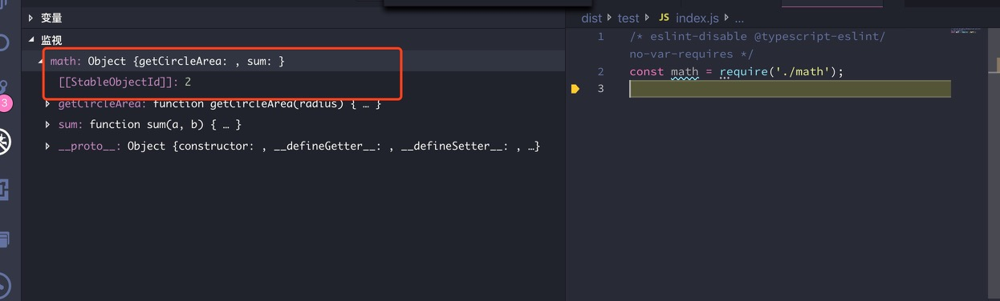

JS 模块语法有很多种，目前最流行的应该是下面两种：

- ES6 import/export
- Commonjs `module.exports`, `exports`, `require`

这两种语法如此流行，所以需要互通有无。

这两个模块语法，大部分兼容性都能通过工具很好的解决，唯独默认导出、导入的兼容性，你如果不掌握一些小窍门，很容易出现 bug。再加上目前流行的 TypeScript，让这种情况变得复杂了一些。

本篇文章阐述它们之间的矛盾点，以及如何解决这些矛盾点。

## Commonjs 的导入和导出

Node.js 采用的是 Commonjs 模块导入、导出标准。Commonjs 非常流行，所以 Rollup、Babel、TypeScript 编译后的代码也用了 Commonjs 的 API。先来看看 Commonjs 的导入和导出的语法。

### 导入、导出

现在有两个 JS 文件，分别是`math.js`和`index.js`，结构如下：

```
项目根目录
|__ math.js
|__ index.js
```

`math.js`:

```js
const PI = 3.14;

function getCircleArea(radius) {
  return PI * radius * radius;
}

function sum(a, b) {
  return a + b;
}

exports.getCircleArea = getCircleArea;
exports.sum = sum;
```

`index.js`:

```js
const { getCircleArea, sum } = require('./math');

const circle1Area = getCircleArea(10);
const circle2Area = getCircleArea(15);
const sumArea = sum(circle1Area, circle2Area);

console.log(
  `第一个圆面积：${circle1Area}，第二个圆面积：${circle2Area}，总面积：${sumArea}`,
);
```

math.js 文件通过`exports`导出了`getCircleArea`和`sum`，而`index.js`通过`require`引入了`getCircleArea`和`sum`。

### 默认导出、默认导入

现在有两个 JS 文件，分别是`PI.js`和`index.js`，结构如下：

```
项目根目录
|__ PI.js
|__ index.js
```

`index.js`需要使用到`PI.js`中定义的`PI`常量。

`PI.js`:

```js
const PI = 3.14;

module.exports = PI;
```

`index.js`:

```js
const PI = require('./PI');

console.log(PI);
```

上面的默认导入与导出没有问题，`index.js`中通过`require('./PI')`获取到的就是`PI`变量。

### Commonjs 中默认导出与普通导出不能兼容

> Commonjs 中，同一个 JS 文件不能同时出现默认导出和普通导出，也就是说，下面的代码是不成立的：
>
> `PI.js`:
>
> ```js
> const PI = 3.14;
>
> const sum = (a, b) => a + b;
>
> module.exports = PI;
> exports.sum = sum; // sum将不会被导出，无法被其他js模块导入
> ```

假定默认导出与普通导出可以兼容，那么我们看看`require('./PI')`如何导入所有导出项：

```js
const PI = require('./PI');

console.log(PI);
console.log(PI.sum); // 假定sum是PI.js中导出的函数
```

这从 JS 语法上就说不通，因为`PI`是`3.14`，就是一个数字，它是不应该有`sum()`函数的。如果你觉得应该可以，那么接着往下看。

```js
// obj.js

const obj = {
  a: 'b',
};

const a = 'c';

module.exports = obj;
exports.a = a;

// index.js

const obj = require('./obj');

console.log(obj.a); // 输出什么？是不是很矛盾？
```

所以，在 Commonjs 中一个 JS 文件无法同时有普通导出和默认导出。

### Commonjs 导出的是什么？

先看看普通导出：

```js
const PI = 3.14;

function getCircleArea(radius) {
  return PI * radius * radius;
}

function sum(a, b) {
  return a + b;
}

exports.getCircleArea = getCircleArea;
exports.sum = sum;
```

导入看看是什么：

```js
const math = require('./math');
```

看看`math`变量是什么：



`math`是一个对象，包含`getCircleArea`和`sum`两个属性。也就是说，`exports`是一个对象，而`require('./math')`获取到的就是`exports`对象。

在 Commonjs 中，一个 js 文件就是一个模块。Nodejs 会为每个模块创建一个`module`对象，代表一个模块信息。`module`对象中有一个`exports`属性，默认值为空对象`{}`。而`require`会获取 js 文件的`module.exports`。这样，上面的 commonjs 代码就很容易理解了。

下面的默认导出代码则是将`module.exports`整个替换掉了：

```js
module.exports = 3.14;
```

这样`module.exports`不再是一个对象，而是数字`3.14`。我们通过`require`引入的也就是一个`3.14`。

## ES6 module

> ES6 module 语法与 Commonjs 语法一个重要区别是，ES6 module 允许同一个 js 文件(模块)同时有默认导出和普通导出。

`calcCircleArea.js`：

```js
export const PI = 3.14;

export default function calcCircleArea(radius) {
  return PI * radius * radius;
}
```

`index.js`:

```js
import calcCircleArea, { PI } from './calcCircleArea';

console.log(`PI = ${PI}, circle area: ${calcCircleArea(10)}.`);
```

## TypeScript 中的模块语法

TypeScript 是在 ES6 的语法基础上添加了类型。所以 TypeScript 中的模块语法与 ES6 的模块语法一致。

## ES6 Module vs Commonjs

在规则上的冲突：

> ES6 module 允许同一个 js 文件(模块)同时有默认导出和普通导出，而 commonjs 不允许。

这就是本文要解决的核心问题。

## 目前的现状：ES6 Module -> Commonjs

当前前端的现状是，大家采用 ES6 Module 写 js 代码，但是通过工具将 ES6 Module 代码转换成 Commonjs 代码。为什么？

需要编译`ES 6 Module`原因主要有：

- 当前浏览器均不支持`ES6 Module`语法
- Node.js 不支持`ES6 Module`语法

编译成`commonjs`语法格式的原因：

- Commonjs 足够流行
- Node.js 支持 commonjs

当前流行的 ES6 编译或者 js 模块处理工具有：

- babel
- rollup

接下来，我们来看看 babel、rollup 以及 TypeScript 编译工具是如何处理 ES6 默认导出的。

## 三个编译工具如何编译 ES6 默认导出

现在有一段 ES6 的代码：

```js
export const PI = 3.14;

export default function calcCircleArea(radius) {
  return PI * radius * radius;
}
```

### Babel 编译结果

```js
'use strict';

Object.defineProperty(exports, '__esModule', {
  value: true,
});
exports.default = calcCircleArea;
exports.PI = void 0;
var PI = 3.14;
exports.PI = PI;

function calcCircleArea(radius) {
  return PI * radius * radius;
}
```

### Rollup 编译结果

```js
'use strict';

Object.defineProperty(exports, '__esModule', { value: true });

const PI = 3.14;

function calcCircleArea(radius) {
  return PI * radius * radius;
}

exports.PI = PI;
exports.default = calcCircleArea;
```

### TypeScript 编译结果

```js
'use strict';
Object.defineProperty(exports, '__esModule', { value: true });
exports.PI = 3.14;
function calcCircleArea(radius) {
  return exports.PI * radius * radius;
}
exports.default = calcCircleArea;
```

### 编译结果分析

三个工具将 ES6 默认导出均翻译成：

```js
exports.default = calcCircleArea;
```

而没有翻译成：

```js
module.exports = calcCircleArea;
```

所以，在 commonjs 中需要按照下面的方式引用：

```js
const { default: calcCircleArea } = require('./calcCircleArea');
```

以上三个工具均有一行相似的代码：

```js
Object.defineProperty(exports, '__esModule', { value: true });
```

这是一行关键代码，兼容`exports.default`和`module.exports`。处理好这二者之间的兼容性，咱们也就处理了 ES6 默认导出和 commonjs 的默认导出兼容问题。

## 三个工具如何编译 ES6 默认导入

现有 ES6 代码：

```js
import calcCircleArea from './calcCircleArea';

console.log(calcCircleArea, PI);
```

### Babel 编译结果

```js
'use strict';

var _calcCircleArea = _interopRequireDefault(require('./calcCircleArea'));

function _interopRequireDefault(obj) {
  return obj && obj.__esModule ? obj : { default: obj };
}

console.log(_calcCircleArea.default);
```

### Rollup 编译结果

```js
'use strict';

function _interopDefault(ex) {
  return ex && typeof ex === 'object' && 'default' in ex ? ex['default'] : ex;
}

var calcCircleArea = require('./calcCircleArea');
var calcCircleArea__default = _interopDefault(calcCircleArea);

console.log(calcCircleArea__default);
```

### TypeScript 编译结果

```js
'use strict';
var __importDefault =
  (this && this.__importDefault) ||
  function(mod) {
    return mod && mod.__esModule ? mod : { default: mod };
  };
Object.defineProperty(exports, '__esModule', { value: true });
var calcCircleArea_1 = __importDefault(require('./calcCircleArea'));
console.log(calcCircleArea_1.default);
```

### 编译结果分析

三者都生成了类似的辅助方法：`_interopRequireDefault`、`_interopDefault`、`__importDefault`。现在拿`_interopRequireDefault`看看：

```js
function _interopRequireDefault(obj) {
  return obj && obj.__esModule ? obj : { default: obj };
}
```

可以看出来，对于默认导入，会判断`__esModule`是否为`true`，如果为 true，Babel 则认为引入的模块中的默认导出是通过`export.default`导出的，否则则是`module.exports`。就是这样一个小小的方法保证了这两者模块语法的兼容性导入。

## 常见错误

### 1. Commonjs 执行不了 ES6 编译后的默认导出

如上述的'calcCircleArea.js'，如果通过下面的方式，代码会报错误：

```js
const calcCircleArea = require('./calcCircleArea');
```

解决方法：

```js
const { default: calcCircleArea } = require('./calcCircleArea');
```

### 2. Babel 中引入 TypeScript 或者 Rollup 编译的模块，编译后的代码提示类似错误：`TypeError: _http.default.post is not a function`

有可能是因为 TypeScript、Rollup 两个工具没有正确设置生成`__esModule`相关的配置导致的。

TypeScript 配置文件`tsconfig.json`中有一个配置项`esModuleInterop`，检查一下是否有此配置项，且为`true`。

Rollup 的`output.esModule`配置设置为`false`则不会产生`__esModule`。检查一下这个配置项。

### 3. TypeScript 中引入 Rollup 或者 TypeScript 编译的模块，编译后的代码提示类似错误：`TypeError: _http.default.post is not a function`

与问题 2 类似。

## 名词

补充几个名词：

- JS 模块：一个 JS 模块就是一个 JS 文件。
- 具名导出：通过`export`而不是`export default`导出的模块元素，因为它们都有自己的名字，所以称之为具名导出。上文提到的普通导出，其实就是具名导出。
- 默认导出：通过`export default`导出的模块元素。

## 参考文章

- [Rollup 官网](https://rollupjs.org)
- [Babel 官网](https://babeljs.io/)
- [TypeScript 官网](http://www.typescriptlang.org/)
- [MDN 中关于 ES6 模块导入的介绍](https://developer.mozilla.org/zh-CN/docs/Web/JavaScript/Reference/Statements/import)
- [MDN 中关于 ES6 模块导出的介绍](https://developer.mozilla.org/zh-CN/docs/Web/JavaScript/Reference/Statements/export)
