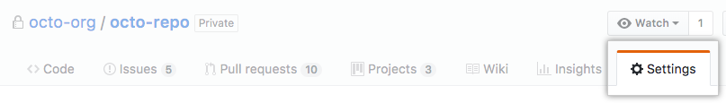
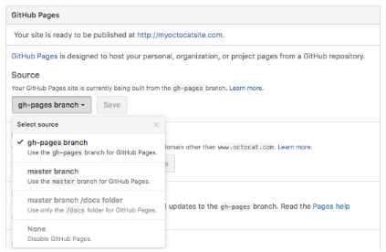
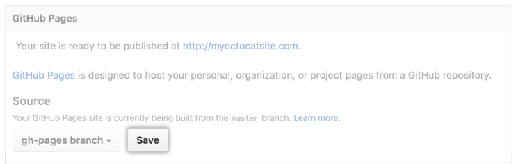
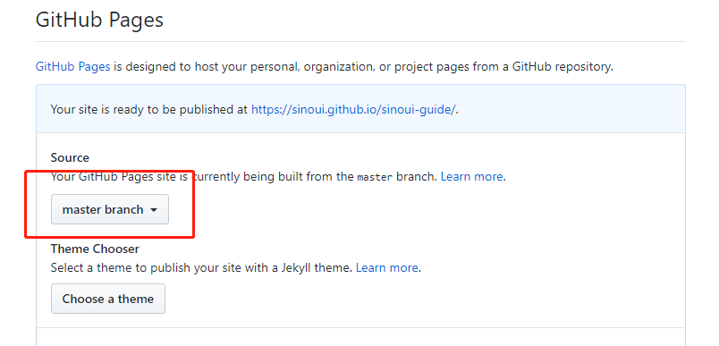

我们经常会有一些静态网页需要发布到公网上，分享给其他人，比如，个人博客、项目文档、演讲稿、前端效果演示等。这种情况下我们有很多云资源可以利用，比较常见的有：

- [Github Pages](https://pages.github.com/)
- [Zeit Now](https://zeit.co/now)
- [JS.ORG - the JavaScript organization](https://js.org/)
- [Netlify](https://www.netlify.com/)
- [Firebase 托管](https://firebase.google.com/docs/hosting)
- [Heroku](https://www.heroku.com/)
- [Surge](https://surge.sh/)

可以托管静态网页内容的云资源还有很多很多，包括各大云平台都推出类似的公用资源供大家免费使用。

大家可以根据个人喜好和工作的便捷性自由选择利用这些资源。本篇文章会向大家介绍[Github Pages](https://pages.github.com/)。

## 目标

本篇文章会向大家介绍 Github Pages 是什么、有什么作用，以及如何将静态资源发布到 Github Pages 上。

## Github Pages 是什么？

Github Pages 是一个可以从你的 Github 源码仓库中直接生成个人、组织或者项目页面的静态站点托管服务。

Github Pages 只能托管静态站点，不能运行服务器端源码，比如 PHP、Java、Python 或者 Ruby。

## 用户、组织和项目页面

> 有两种基本类型的 Github Pages 站点：项目页面站点、用户与组织页面站点。它们几乎相同，但是有一些重点区别。

我们可以从站点的 url 区分出站点类型：

- Facebook 站点： <https://facebook.github.io> - **组织站点**
- create-react-app 站点： <https://facebook.github.io/create-react-app/> - **项目站点**

URL 的规则如下：

- 个人站点形式是：`https://<username>.github.io`
- 组织站点形式是：`https://<orgname>.github.io`
- 个人账号的项目站点形式是：`https://<username>.github.io/<projectname>`
- 组织账号的项目站点形式是：`https://<orgname>.github.io/<projectname>`

### 项目页面站点

项目页面站点的文档文件和项目是放在同一个 Github 仓库中的，这些文档文件应在下面几个位置之一：

- 在`master`分支上
- 在`gh-pages`分支上
- 在`master`分支上的`docs`目录中

这些位置上需要有一个首页文档，可以是：

- README.md
- index.html

#### 如何配置项目页面站点？

首先，确定好你的项目的文档放在哪个分支和位置上。确定好后，打开项目的 Github 页面，点击`Settings`页签：



然后滚动页面找到`Github Pages`设置，并选择文档文件的位置：



最后，点击保存按钮：



这样，咱们就完成了 Github Pages 的部署。自动产生的 Github Pages 的 URL 是：

- 如果你的项目在你个人账户下面，则 GitHub Pages 的链接是：`http(s)://<username>.github.io/<projectname>`。
- 如果你的项目在组织账号下面，则 GitHub Pages 的链接是：`http(s)://<orgname>.github.io/<projectname>`。

### 用户与组织页面站点

用户与组织页面站点的文档文件放在一个独立的项目的`master`分支上，并且项目仓库名称必须遵循以下规则：

- 如果你创建的是用户页面站点，则 Github 仓库名称为`<username>.github.io`。
- 如果你创建的是组织页面站点，则 Github 仓库名称为`<orgname>.github.io`。

接下来，我们看看如何使用 Github Pages，完成这两种类型的站点部署。

## 如何使用 Github Pages？

### 发布用户与组织页面站点

我们可以创建一个文档项目，这个文档项目有一个`index.html`，然后我们将这个项目按照下面的步骤放到 Github Pages 上。

第一步，创建一个 Github 项目，项目名称为`username.github.io`，其中`username`为你的姓名或者组织名称或者任何你想到的名称。如下图：


第二步，我们将项目克隆到本地。打开命令行工具，执行下面的命令：

```shell
git clone https://github.com/username/username.github.io
```

第三步，在项目根目录下创建`index.html`文件，写入`Hello, World!`。

第四步，提交新创建的文件到 Github 上：

```shell
git add --all
git commit -m "Initial commit"
git push -u origin master
```

在浏览器上打开**`https://username.github.io`**，看看效果。

### 发布项目页面站点

这个章节我们将如何发布项目页面站点。页面站点的文档有三种位置，本章节选择`master`分支这种情况来讲解。我们的项目类似如下面的目录结构：

```
project-name
|__ src
|__ README.md -- 这是项目文档的首页文件
|__ package.json
|__ yarn.lock
```

首先，如果 Github 上还没有你的项目，则你需要在 Github 上创建一个项目。

然后，按照[如何配置项目页面站点？](#如何配置项目页面站点？)这个章节做好 Github Pages 配置。请选择`master branch`：



提交源码到 Github 仓库的`master`分支后，打开`http(s)://<username|orgname>.github.io/<projectname>`查看文档页面。

## 动态生成项目文档的项目站点

有很多项目的文档是由类似如[docz](http://docz.site)、[docusaurus](https://docusaurus.io/)等工具管理并动态生成的。这种情况下，我们的基本思路是：

- 在 Github Pages 配置中，选择文档文件位置为`gh-pages barnch`。
- 在`master`分支上，通过 docz、docusaurus 等工具编译项目文档，文档一般会放在类似如`build`目录中。
- 切换到`gh-pages`分支上，将除`build`目录的其他内容全部删除，然后将`build`目录中的文件拷贝到项目根目录中。
- 执行下面的命令行，将变更文件提交到 Github 上。

```shell
git add .
git commit -m "更新文档"
git push origin gh-pages
```

这样我们就完成了动态文档内容的发布到 Github Pages 上的工作。

这样的工作比较繁琐，而且比较容易出错，如果你维护的是一个 npm 项目，那么可以使用[gh-pages](https://github.com/tschaub/gh-pages)帮助我们完成这些手工的工作。接下来，我们看看`gh-pages`是如何简化发布过程的。

### gh-pages 工具

这里以发布`create-react-app`创建的 React 项目为例讲解如何使用`gh-pages`将 react 项目发布到 Github Pages 上。

首先，安装依赖：

```shell
yarn add --dev gh-pages
```

打开`package.json`文件，在`scripts`中添加两个命令行：

```json
scripts: {
  "predeploy": "yarn build",
  "deploy": "gh-pages -d build"
}
```

我们执行`yarn deploy`命令行，即可完成发布工作。

React 项目构建之后，会将构建文件放在`build`目录中，所以我们通过`gh-pages -d build`这一行命令，将`build`目录中的文件发布到 Github Pages 上。

## 总结

本篇文章跟大家分享了如何使用[Github Pages](https://pages.github.com/)发布静态站点。当我们要写博客、分享想法、培训材料、演讲稿、发布开源项目时，可以使用类似 Github Pages 这样的站点托管服务。

做开源项目时，要从文档开始，先弄清楚你开源的项目是用来干什么的、别人怎么使用你的项目、能解决什么实际问题等。文档齐全的开源项目更易受欢迎。

## 参考文档

- [Github Pages](https://pages.github.com/)
- [Configuring a publishing source for GitHub Pages](https://help.github.com/en/articles/configuring-a-publishing-source-for-github-pages)
- [User, Organization, and Project Pages](https://help.github.com/en/articles/user-organization-and-project-pages)
- [What is GitHub Pages?](https://help.github.com/en/articles/what-is-github-pages)
