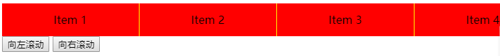

在日常 Web 开发中，我们可以使用 css transition 或者 css animation 实现动画，但是有一些动画场景不太容易使用 css 技术实现，比如：

- 滚动效果
- 数字变换
- svg 路径动画
- canvas 动画

本篇文章关注的是如何使用 JavaScript 实现简单的动画。包括以下内容：

- 使用 `requestAnimationFrame` 实现滚动动画效果
- 使用缓动函数实现平滑的滚动动画效果
- 使用 [rebound.js](https://github.com/facebook/rebound-js) 实现更平滑的滚动动画效果

## 使用 `requestAnimationFrame` 实现滚动动画

有一个包含 20 个元素的隐藏了滚动条的容器，点击“向左滚动”和“向右滚动”按钮，则容器的内容则会滚动 500 px。如下图所示：



点击 [codesandbox](https://codesandbox.io/s/loving-tdd-ze5gp) 查看效果。

HTML 代码如下：

```html
<div class="scroller">
  <div class="item">Item 1</div>
  <div class="item">Item 2</div>
  <div class="item">Item 3</div>
  ...
</div>
<button id="scrollToLeftButton">向左滚动</button>
<button id="scrollToRightButton">向右滚动</button>
```

JavaScript 代码如下：

```tsx
const scrollToLeftButton = document.getElementById('scrollToLeftButton');
const scrollToRightButton = document.getElementById('scrollToRightButton');
const scroller = document.querySelector('.scroller');

scrollToLeftButton.addEventListener(
  'click',
  () => {
    scroller.scrollLeft -= 500;
  },
  false,
);

scrollToRightButton.addEventListener(
  'click',
  () => {
    scroller.scrollLeft += 500;
  },
  false,
);
```

这个基础实现会在点击“向左滚动”和“向右滚动”按钮时，会滚动 250 px，但是没有动画效果，是立即完成滚动过程。接下来，我们使用 `requestAnimationRequest` 来实现一个简单的滚动动画。我们设定在 300ms 完成 250 px 的滚动距离。

```tsx
/**
 * 运行动画：在指定时间内将数字从 start 匀速变化到 end。
 *
 * @param start 开始数字
 * @param end 结束数字
 * @param duration 动画运行时长
 * @param callback 动画过程中每一帧执行的回调函数
 */
function animate(start, end, duration, callback) {
  const startTime = Date.now();
  const delta = end - start;

  let rafId;
  const tick = () => {
    const elapsed = Date.now() - startTime;
    const value = start + delta * Math.min(1, elapsed / duration);

    callback(value);

    if (elapsed < duration) {
      rafId = requestAnimationFrame(tick);
    } else {
      rafId = undefined;
    }
  };

  tick();

  return () => rafId && cancelAnimationFrame(rafId);
}
```

上面定义的 `animate` 函数会在指定时间内将数字从 `start` 递增或者递减到 `end`。

替换滚动按钮的点击事件监听器：

```tsx
let cancel;
scrollToLeftButton.addEventListener(
  'click',
  () => {
    const start = scroller.scrollLeft;
    const end = Math.max(0, start - 500);
    if (cancel) {
      // 取消之前的动画
      cancel();
    }
    cancel = animate(start, end, 300, (value) => (scroller.scrollLeft = value)); // 开始动画
  },
  false,
);

scrollToRightButton.addEventListener(
  'click',
  () => {
    const { scrollLeft, scrollWidth } = scroller;
    const end = Math.min(scrollWidth, scrollLeft + 500);
    if (cancel) {
      // 取消之前的动画
      cancel();
    }
    cancel = animate(
      scrollLeft,
      end,
      300,
      (value) => (scroller.scrollLeft = value),
    ); // 开始动画
  },
  false,
);
```

点击 [codesandbox](https://codesandbox.io/s/distracted-cannon-scppz) 查看效果。

🎉 我们实现了滚动动画！但是别高兴得太早，还是留有遗憾的，仔细观察滚动动画，我们可能会发现这个动画太“呆板”了。问题出在滚动是匀速的。实际上我们希望一开始是加速滚动，之后是减速滚动，直到停止滚动，到达目的地。学过 css transition 或者 css animation，都知道有一个概念，即缓动函数。下一章节我们就来仿照 css 的 `ease-in-out` 实现更平滑的滚动动画。

## 使用缓动函数实现滚动动画

css 支持以贝塞尔曲线为基础的缓动函数。可以从 [Easing Functions Cheat Sheet](https://easings.net/) 查看更多缓动效果。可以从 [gizma: JavaScript Easing Functions](http://gizma.com/easing/) 找到缓动函数的 JavaScript 实现。

滚动动画需要的缓动函数是 `ease-in-out`，下面我们看如何改造`animate()`函数，添加 `ease-in-out` 缓动效果，以实现平滑的滚动动画。

我们先实现 `easeInOut` （摘自[js-easing-functions](https://github.com/bameyrick/js-easing-functions) ）：

```tsx
function easeInOut(
  elapsed: number,
  initialValue: number,
  amountOfChange: number,
  duration: number,
): number {
  if ((elapsed /= duration / 2) < 1) {
    return (amountOfChange / 2) * elapsed * elapsed * elapsed + initialValue;
  }
  return (
    (amountOfChange / 2) * ((elapsed -= 2) * elapsed * elapsed + 2) +
    initialValue
  );
}
```

也可以使用 [js-easing-functions](https://github.com/bameyrick/js-easing-functions) 库中的 `easeInOutCubic`。

然后，改造 `animate()` 函数：

```tsx
/**
 * 运行动画。
 *
 * @param start 开始数字
 * @param end 结束数字
 * @param duration 动画运行时长
 * @param callback 动画过程中每一帧执行的回调函数
 */
function animate(start, end, duration, callback) {
  const startTime = Date.now();
  const delta = end - start;

  let rafId;
  const tick = () => {
    const elapsed = Date.now() - startTime;
    const value = easeInOut(elapsed, start, delta, duration); // 使用缓动函数求值

    callback(value);

    if (elapsed < duration) {
      rafId = requestAnimationFrame(tick);
    } else {
      rafId = undefined;
    }
  };

  tick();

  return () => rafId && cancelAnimationFrame(rafId);
}
```

点击 [codesandbox](https://codesandbox.io/s/distracted-cannon-scppz) 查看效果。

🎉🎉 滚动动画有起伏了，看起来更自然了。如果关注过动画效果，应该听说过“弹簧动力学”。没听过也没关系，只要记住，“弹簧动力学”更适合做动画效果。下一章节，我们就给滚动动画应用上“弹簧动力学”，替换掉 `ease-in-out` 。

## 使用 rebound.js 实现滚动动画

[rebound.js](https://github.com/facebook/rebound-js) 是弹簧动力学的 JavaScript 实现。本章节将使用其改造 `animate()` 函数，以实现更自然的滚动动画。

```tsx
import { SpringSystem } from 'rebound';

/**
 * 运行动画。
 *
 * @param start 开始数字
 * @param end 结束数字
 * @param callback 动画过程中每一帧执行的回调函数
 */
function animate(start, end, callback) {
  const springSystem = new SpringSystem();
  const spring = springSystem.createSpring();

  spring.addListener({
    onSpringUpdate: () => {
      const value = spring.getCurrentValue();
      callback(value);
    },
  });

  spring.setCurrentValue(start).setAtRest();
  spring.setEndValue(end);

  return () => {
    springSystem.deregisterSpring(spring);
    springSystem.removeAllListeners();
    spring.destroy();
  };
}
```

注意，“弹簧动力学”动画是不需要指定时长的，所以我们去掉 `duration` 参数：

```tsx
let cancel;
scrollToLeftButton.addEventListener(
  'click',
  () => {
    const start = scroller.scrollLeft;
    const end = Math.max(0, start - 500);
    if (cancel) {
      // 取消之前的动画
      cancel();
    }
    cancel = animate(start, end, (value) => (scroller.scrollLeft = value)); // 开始动画
  },
  false,
);

scrollToRightButton.addEventListener(
  'click',
  () => {
    const { scrollLeft, scrollWidth } = scroller;
    const end = Math.min(scrollWidth, scrollLeft + 500);
    if (cancel) {
      // 取消之前的动画
      cancel();
    }
    cancel = animate(scrollLeft, end, (value) => (scroller.scrollLeft = value)); // 开始动画
  },
  false,
);
```

点击 [codesandbox](https://codesandbox.io/s/mutable-brook-lurot) 查看效果。

🎉🎉🎉 我们使用“弹簧动力学”实现了非常平滑的滚动效果。

## 小结

我们通过本篇文章学习到使用 `requestAnimationFrame` 和缓动函数实现简单动画，并学习到使用 [rebound-js](https://github.com/facebook/rebound-js) 实现“弹簧”动画效果。当然，我们也可以使用具有更高抽象层次的动画库来实现类似动画效果，如：

- [react-spring](https://github.com/react-spring/react-spring)
- [popmotion](https://popmotion.io/)
- [framer motion](https://www.framer.com/api/motion/)
- [tween.js](https://github.com/tweenjs/tween.js)

如果我们正在实现的是基础 UI 库，那么比较推荐类似本篇文章推荐的低抽象层次方式，除非你决定你的 UI 库动效基于第三方动画库实现。毕竟，我们需要考量 UI 库的大小。

## 参考文章

- [react-custom-scrollbars](https://github.com/malte-wessel/react-custom-scrollbars)
- [rebound-js](https://github.com/facebook/rebound-js)
- [Easing Functions Cheat Sheet](https://easings.net/)
- [js-easing-functions](https://github.com/bameyrick/js-easing-functions)
- [ease-in, out; eas-out, in](https://css-tricks.com/ease-out-in-ease-in-out/)
- [MDN: transition](https://developer.mozilla.org/en-US/docs/Web/CSS/transition)
- [MDN: timing-function](https://developer.mozilla.org/en-US/docs/Web/CSS/timing-function)
- [规范：css transitions: timing-function](https://drafts.csswg.org/css-transitions/#transition-timing-function)
- [规范：css animations: timing-function](https://drafts.csswg.org/css-animations/#animation-timing-function)
- [Why spring and not durations](https://github.com/react-spring/react-spring#why-springs-and-not-durations)
