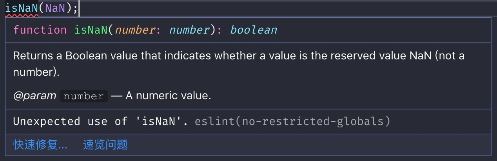

如果你在代码中编写`isNaN(arg)`这样的代码，很有可能得到类似下面的提示错误：



上图是一个 eslint 错误提示，警告我们不要使用`isNaN`。这是怎么回事呢？本篇文章就是从这个错误提示开始的，介绍如何正确处理数值判断。

（注：上图是 eslint 配置了[eslint-config-airbnb](https://www.npmjs.com/package/eslint-config-airbnb-base)之后产生的错误提示。）

## NaN

全局属性`NaN`的值表示不是一个数字（`Not-A-Number`）。按照规范定义，`NaN`是一种特殊的数值，表示的是非数字的数值。当你在执行的任何数学运算无法得到数字时，我们就用`NaN`表示结果。比如`parseInt('babala')`是无法解析出数字的，这时会返回`NaN`。再比如`10 / 'foo'`是无法得到数字结果的，这时会返回`NaN`。注意`10 / 0`并不会返回`NaN`，而是返回`Infinity`，表示无穷大。

示例 1：

```js
const result = parseInt('babala'); // NaN

typeof result === 'number'; // true
```

示例 2：

```js
const result = 10 / 'foo'; // NaN

typeof result === 'number'; // true
```

示例 3：

```js
const result = 10 / 0; // Infinity
```

### 犯了错误的`isNaN`

> 不要使用全局方法`isNaN()`来判断一个值是否是`NaN`。

先来看几行代码：

```js
isNaN(10 / 'foo'); // true

isNaN(undefined); // true
```

为什么`isNaN(undefined)`的结果会是 true 呢？

这是因为 `isNaN(x)` 在进行判断时会进行一些奇怪的转换。如果其参数不是`number`类型时，isNaN 函数首先会尝试将参数转换为`number`类型，然后进行判断。`undefined`在进行数值转换时，会返回`NaN`，`isNaN(NaN)`的值为 true，因此`isNaN(undefined)`会返回 true。

鉴于开篇`eslint`检测错误，我们可以考虑替换`isNaN`方法。通过对比发现有以下可用的替换方式：

- [Number.isNaN](https://developer.mozilla.org/zh-CN/docs/Web/JavaScript/Reference/Global_Objects/Number/isNaN)
- [is-nan](https://www.npmjs.com/package/is-nan)
- [lodash | isNaN](https://www.lodashjs.com/docs/latest#_isnanvalue)

以上三种方式都是判断数值类型是否为`NaN`，与全局`isNaN`方法不同的是，它们不会强制将参数转换成数字，只有在参数是真正的数字类型，且值为 NaN 的时候才会返回 true。

注意：由于 IE 浏览器和 Safari 浏览器均不支持`Number.isNaN`，因此我们建议使用`is-nan`或者`lodash`的`isNaN`方法替换全局的`isNaN`方法。

## 判断是否是数字

如果我们需要判断指定的值是否可以作为数字类型的值使用时，可以使用[is-number](https://github.com/jonschlinkert/is-number)。

使用方式：

需要执行下面的命令行安装依赖：

```shell
yarn add is-number
```

```js
isNumber(5e3); // true
isNumber(1.1); // true
isNumber(10); // true

isNumber(Infinity); // false
isNumber(NaN); // false
isNumber(null); // false
isNumber(undefined); // false
```

除此之外，我们也可以使用[lodash | isNumber](https://www.lodashjs.com/docs/latest#_isnumbervalue)。

同样我们需要安装依赖：

```shell
yarn add lodash
```

使用时可以只引入自己需要的包，如：

```js
import isNumber from 'lodash/isNumber';

isNumber(3); //true

isNumber(Number.MIN_VALUE); // true
isNumber(Infinity); //true

isNumber('3'); //false
```

## 参考资料

- [You-Dont-Know-JS: The Not Number, Number](https://github.com/getify/You-Dont-Know-JS/blob/master/types%20%26%20grammar/ch2.md#the-not-number-number)
- [Airbnb JavaScript: Standard Library](https://github.com/airbnb/javascript#standard-library)
- [eslint-config-airbnb](https://www.npmjs.com/package/eslint-config-airbnb)
- [eslint: no-restricted-globals](https://eslint.org/docs/rules/no-restricted-globals)
- [MDN: NaN](https://developer.mozilla.org/zh-CN/docs/Web/JavaScript/Reference/Global_Objects/NaN)
- [ECMAScript 5.1 Spec: NaN](https://www.ecma-international.org/ecma-262/5.1/#sec-15.1.1.1)
- [百度百科: NaN](https://baike.baidu.com/item/nan/7455322?fr=aladdin)
- [Lodash 中文文档](https://www.lodashjs.com/)
- [is-number 官网](https://github.com/jonschlinkert/is-number#is-number----)
- [is-nan](https://github.com/ljharb/is-nan)
- [MDN: Number.isNaN](https://developer.mozilla.org/zh-CN/docs/Web/JavaScript/Reference/Global_Objects/Number/isNaN)
