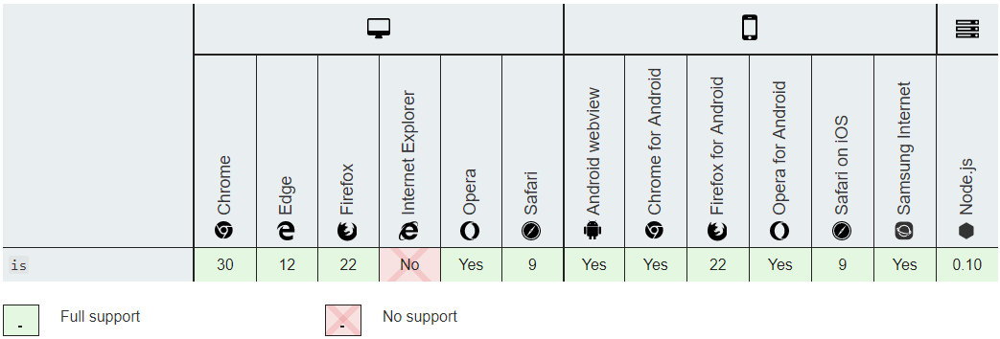

自 2015 年发布 ES6 之后，JavaScript 新语法层出不穷，每年都有发布新的特性。但是旧版本浏览器却不会同步支持这些新的特性。如果是语法级别的新特性，可以通过[Babel](https://babeljs.io)或者[TypeScript](http://www.typescriptlang.org)等工具将新语法转译成 ES5 语法，这样就解决了旧版本浏览器关于 ES6 新语法的兼容问题。但是如果是新的 API，如 IE11 不支持 ES6 发布的`Array.prototype.includes`方法，就很难通过工具自动处理。对于新 API，我们一般使用`polyfill`，来弥补缺失的 API。

本篇文章会列举出常用的兼容 IE11 的`polyfill`，以指导大家在开发 React 应用或者库时，能正确处理新的 API 的兼容性问题。

> 注意： 我们的库和应用需要兼容 IE11。

## polyfill 是什么

我们来看一个 ES6 中的 API： [Object.is](https://developer.mozilla.org/zh-CN/docs/Web/JavaScript/Reference/Global_Objects/Object/is)。这个方法用来比较两个值是否相同，也就是引用相等性判断。

看一下这个 API 的浏览器兼容性：



可以看到 IE11 是不支持`Object.is`的。

我们可以根据[Object.is 的描述](https://developer.mozilla.org/zh-CN/docs/Web/JavaScript/Reference/Global_Objects/Object/is#%E6%8F%8F%E8%BF%B0)自己实现一个：

```javascript
if (!Object.is) {
  Object.is = function(x, y) {
    // SameValue algorithm
    if (x === y) {
      // Steps 1-5, 7-10
      // Steps 6.b-6.e: +0 != -0
      return x !== 0 || 1 / x === 1 / y;
    } else {
      // Step 6.a: NaN == NaN
      return x !== x && y !== y;
    }
  };
}
```

这个实现先判断是否已经有了`Object.is`，如果没有，就自己实现一下。这就是`polyfill`，就像是补丁，通过补丁可以让我们在代码中使用新的 API 而不用担心浏览器兼容性问题。

当然，我们必须在使用`Object.is`之前引用`Object.is`的 polyfill。例如 React 应用：

`polyfills.js`:

```javascript
// 在这里放所有的polyfill引用。
require('core-js/modules/es.object.is.js');
```

`index.js`:

```javascript
import './polyfills'; // 必须在第一行引用哟，要不然有可能会出错。
import ReactDOM from 'react-dom';
import App from './App';

ReactDOM.render(<App />, document.getElementById('root'));
```

[core-js](https://github.com/zloirock/core-js)提供了大量新 API 的 polyfill，缺什么去这里找。

## Polyfill 怎么用

> 因为需要 polyfill 的 API 特别多，为了不增加 JS 包大小，所以我们一般采用使用哪个新的 API，就引入这个新的 API 的 Polyfill。当然如果你的应用中用了特别多的新 API，你也可以整体引入 polyfills。

### 整体引用

首先安装依赖：

```shell
yarn add core-js regenerator-runtime
```

在`polyfill.js`文件中引入：

```javascript
import 'core-js/stable';
import 'regenerator-runtime/runtime';
```

### 部分引用

以 React 应用为例说明。

首先安装依赖：

```shell
yarn add react-app-polyfill core-js regenerator-runtime
```

在`polyfill.js`文件中引入：

```javascript
import 'react-app-polyfill/ie11';

// 应用中使用了array.includes()
import 'core-js/modules/es6.array.includes';
```

可以看一下`react-app-polyfill/ie11`包含哪些 polyfill:

```typescript
if (typeof Promise === 'undefined') {
  // Rejection tracking prevents a common issue where React gets into an
  // inconsistent state due to an error, but it gets swallowed by a Promise,
  // and the user has no idea what causes React's erratic future behavior.
  require('promise/lib/rejection-tracking').enable();
  window.Promise = require('promise/lib/es6-extensions.js');
}

// Make sure we're in a Browser-like environment before importing polyfills
// This prevents `fetch()` from being imported in a Node test environment
if (typeof window !== 'undefined') {
  // fetch() polyfill for making API calls.
  require('whatwg-fetch');
}

// Object.assign() is commonly used with React.
// It will use the native implementation if it's present and isn't buggy.
Object.assign = require('object-assign');

// Support for...of (a commonly used syntax feature that requires Symbols)
require('core-js/features/symbol');
// Support iterable spread (...Set, ...Map)
require('core-js/features/array/from');
```

## 库如何使用 polyfill

一般不建议在库的源码中直接引用 polyfill，因为有可能会引起比较怪异的打包问题。但是库可以使用新的 API，只是需要在`README.md`文档的醒目位置说明一下使用的新 API 的兼容性问题。
