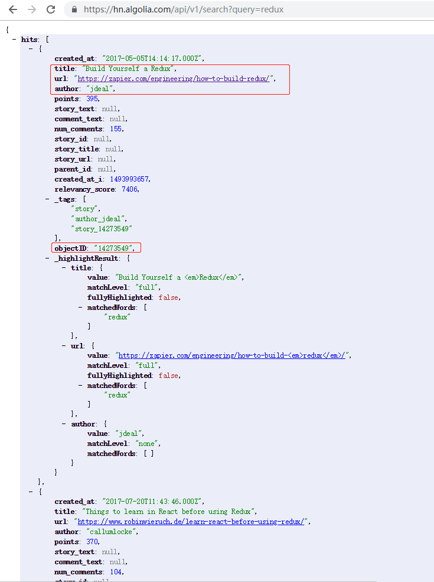
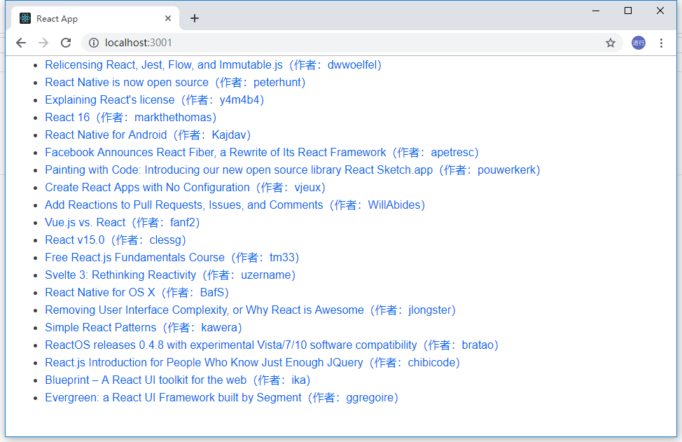
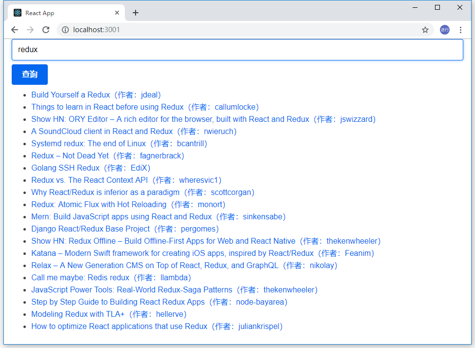

## 准备

在学习 React 中加载数据之前，需要掌握一些基础知识，如下：

- [JSX、React 组件](react-getting-started.md)
- [useState](https://zh-hans.reactjs.org/docs/hooks-state.html)
- [useEffect](https://zh-hans.reactjs.org/docs/hooks-effect.html)
- [useReducer](https://zh-hans.reactjs.org/docs/hooks-reference.html#usereducer)
- [使用 Axios 调用 API](https://github.com/axios/axios)
- [ES2015: async/await 语法](https://developer.mozilla.org/zh-CN/docs/Web/JavaScript/Reference/Statements/async_function)
- [自定义 Hook](https://zh-hans.reactjs.org/docs/hooks-custom.html)

使用[create-react-app](https://facebook.github.io/create-react-app/)创建一个空的 React 项目，并在`index.css`中添加上[primitive.css](assets/css/primitive.css)样式。

## 目标

通过本教程可掌握使用 React Hooks 如何加载数据，包括数据加载、加载指示器、错误提示、取消数据加载以及自定义数据加载 hook 以达到复用数据加载处理逻辑的目的。

本文将介绍大家实现一个简单的数据加载 demo：使用[Hacker News API](https://hn.algolia.com/api)获取科技界中的流行文章。

[在 Github 上查看源码](https://github.com/sinoui/react-fetch-data-tutorial)

[查看效果](https://sinoui.github.io/react-fetch-data-tutorial/)

注意：React 即将推出的 Suspense 更适合做数据加载。等 React 推出 Suspense 之后，再补充文章以说明。

## 使用 React Hooks 加载数据

首先预览一下 Hacher News API 的数据结构：



红框中的字段是我们这次 demo 需要用到的字段。

接着我们实现一下展示文章列表。打开`App.js`文件，定义一个`data`状态，代表从[Hacker News API](https://hn.algolia.com/api)获取到的文章结果。在页面上我们展现出每篇文章的标题、作者，并且可点击查看文章。

```jsx
import React, { useState } from 'react';

function App() {
  const [data, setData] = useState({
    hits: [],
  });

  return (
    <div className="container">
      <ul>
        {data.hits.map((article) => (
          <li key={article.objectID}>
            <a href={article.url}>
              {article.title}（作者：{article.anchor}）
            </a>
          </li>
        ))}
      </ul>
    </div>
  );
}

export default App;
```

我们即将用[axios](https://github.com/axios/axios)加载数据，当然你也可以用其他的库或者 Fetch API 加载数据。我们需要在项目中通过`yarn add axios`命令行添加`axios`依赖。我们需要在`App`组件创建时就去加载数据，而加载数据属于“副作用”，需要在 effect hook 中执行数据加载：

```jsx
import React, { useState, useEffect } from 'react';
import axios from 'axios';

function App() {
  const [data, setData] = useState({
    hits: [],
  });

  useEffect(async () => {
    const result = await axios(
      'http://hn.algolia.com/api/v1/search?query=react',
    );

    setData(result.data);
  });

  return (
    <div className="container">
      <ul>
        {data.hits.map((article) => (
          <li key={article.objectID}>
            <a href={article.url}>
              {article.title}（作者：{article.anchor}）
            </a>
          </li>
        ))}
      </ul>
    </div>
  );
}

export default App;
```

当你启动上面代码后，发现页面会进入一个死循环，会不停地发送请求。这是因为 effect hook 不仅仅会在组件创建时（准确说是组件 mount 后）被调用，在组件每次渲染时也会被调用（组件状态发生变化就会引起组件重新渲染）。**我们只需要在组件 mount 时加载数据**。我们给`useEffect()`函数的第二参数设置为`[]`，即可让这个 effect hook 只在组件 mount 时被调用，这样就修复了无限发送请求的缺陷：

```jsx
import React, { useState, useEffect } from 'react';
import axios from 'axios';

function App() {
  const [data, setData] = useState({
    hits: [],
  });

  useEffect(async () => {
    const result = await axios(
      'http://hn.algolia.com/api/v1/search?query=react',
    );

    setData(result.data);
  }, []);

  return (
    <div className="container">
      <ul>
        {data.hits.map((article) => (
          <li key={article.objectID}>
            <a href={article.url}>
              {article.title}（作者：{article.anchor}）
            </a>
          </li>
        ))}
      </ul>
    </div>
  );
}

export default App;
```

现在启动项目看看页面效果吧。



在页面上按下`F12`键打开 devtools，然后打开`console`页签，你会看到一个警告信息：**Effect callbacks are synchronous to prevent race conditions. Put the async function inside:...**。这个警告告诉我们，咱们不能在`useEffect`中用`async`函数。我们稍微调整一下代码，以消除这个警告：

```jsx
import React, { useState, useEffect } from 'react';
import axios from 'axios';

function App() {
  const [data, setData] = useState({
    hits: [],
  });

  useEffect(() => {
    async function fetchData() {
      const result = await axios(
        'http://hn.algolia.com/api/v1/search?query=react',
      );

      setData(result.data);
    }

    fetchData();
  }, []);

  return (
    <div className="container">
      <ul>
        {data.hits.map((article) => (
          <li key={article.objectID}>
            <a href={article.url}>
              {article.title}（作者：{article.anchor}）
            </a>
          </li>
        ))}
      </ul>
    </div>
  );
}

export default App;
```

遵循[关注点分离](https://en.wikipedia.org/wiki/Separation_of_concerns)原则，我们创建一个`ArticleList`组件，将文章列表展现代码放入到这个组件中，如下：

`ArticleList.js`:

```jsx
import React from 'react';

function ArticleList(props) {
  const { articles } = props;

  return (
    <ul>
      {articles.map((article) => (
        <li key={article.objectID}>
          <a href={article.url}>
            {article.title}（作者：{article.anchor}）
          </a>
        </li>
      ))}
    </ul>
  );
}

export default ArticleList;
```

`App.js`:

```jsx
import React, { useState, useEffect } from 'react';
import axios from 'axios';
import ArticleList from './ArticleList';

function App() {
  const [data, setData] = useState({
    hits: [],
  });

  useEffect(() => {
    async function fetchData() {
      const result = await axios(
        'http://hn.algolia.com/api/v1/search?query=react',
      );

      setData(result.data);
    }

    fetchData();
  }, []);

  return (
    <div className="container">
      <ArticleList articles={data.hits} />
    </div>
  );
}

export default App;
```

我们将文章展现的代码提取到`ArticleList`组件中，这个过程称之为[提取组件](https://zh-hans.reactjs.org/docs/components-and-props.html#extracting-components)。我们将这种通过调整代码以提升代码可读性的行为，称之为[重构](https://baike.baidu.com/item/%E9%87%8D%E6%9E%84/2182519?fr=aladdin)。重构应发生在我们编码过程中的时时刻刻，当我们发现代码很难被阅读时，就是我们停下来思考如何让它变得更清晰并付诸行动的时候。在重构中的说法就是，一旦你发现代码有坏味道，别放过它。

## 如何再次执行 effect hook？

刚刚实现的文章列表，只会在组件 mount 时加载数据。这次我们需要添加一个查询功能，默认查询的是`react`相关的文章，我们可以通过查询功能查询其他相关文章，如查询`redux`、`angular`等相关的文章。这就需要我们在查询关键词发生变化时再次执行发送请求的 effect hook。

首先，我们创建一个查询表单组件`QueryForm.js`，这个查询表单会在提交表单时调用`handleSubmit`属性，并将`query`传递给`handleSubmit()`。

```jsx
import React, { useState } from 'react';

function QueryForm(props) {
  const [query, setQuery] = useState('react');

  return (
    <form
      onSubmit={(event) => {
        event.preventDefault();
        props.handleSubmit(query);
      }}
    >
      <input
        type="text"
        value={query}
        onChange={(event) => setQuery(event.target.value)}
      />
      <input type="submit" value="查询" />
    </form>
  );
}

export default QueryForm;
```

我们在`App.js`中，加载`QueryForm.js`：

```jsx
import React, { useState, useEffect } from 'react';
import axios from 'axios';
import ArticleList from './ArticleList';
import QueryForm from './QueryForm';

function App() {
  const [data, setData] = useState({
    hits: [],
  });

  useEffect(() => {
    async function fetchData() {
      const result = await axios(
        'http://hn.algolia.com/api/v1/search?query=react',
      );

      setData(result.data);
    }

    fetchData();
  }, []);

  return (
    <div className="container">
      <QueryForm />
      <ArticleList articles={data.hits} />
    </div>
  );
}

export default App;
```

`App`组件需要维护查询关键字这个状态，取名为`search`，当`QueryForm`提交时，更新`search`状态，如下所示：

```jsx
import React, { useState, useEffect } from 'react';
import axios from 'axios';
import ArticleList from './ArticleList';
import QueryForm from './QueryForm';

function App() {
  const [data, setData] = useState({
    hits: [],
  });
  const [search, setSearch] = useState('react');

  useEffect(() => {
    async function fetchData() {
      const result = await axios(
        'http://hn.algolia.com/api/v1/search?query=react',
      );

      setData(result.data);
    }

    fetchData();
  }, []);

  return (
    <div className="container">
      <QueryForm handleSubmit={setSearch} />
      <ArticleList articles={data.hits} />
    </div>
  );
}

export default App;
```

打开页面，在输入框中输入`redux`，然后点击查询，你会发现文章列表纹丝不动。这是因为`useEffect(fn, [])`的第二个参数是`[]`，导致这个 effect hook 只会在组件 mount 时被执行，而组件更新时不会被调用。为了让 effect hook 在`search`状态发生变化时也执行一次，我们需要将`search`状态放在第二个参数的数组中，即`useEffect(fn, [search])`：

```jsx
import React, { useState, useEffect } from 'react';
import axios from 'axios';
import ArticleList from './ArticleList';
import QueryForm from './QueryForm';

function App() {
  const [data, setData] = useState({
    hits: [],
  });
  const [search, setSearch] = useState('react');

  useEffect(() => {
    async function fetchData() {
      const result = await axios(
        `http://hn.algolia.com/api/v1/search?query=${search}`,
      );

      setData(result.data);
    }

    fetchData();
  }, [search]);

  return (
    <div className="container">
      <QueryForm handleSubmit={setSearch} />
      <ArticleList articles={data.hits} />
    </div>
  );
}

export default App;
```

打开页面，在输入框中输入`redux`或者任何你想输入的文字，点击查询按钮，你的文章列表就会在很短的时间内发生变化。效果如下：



`QueryForm`中的`query`状态与`App`中的`search`状态在初始和表单提交时是一样的值。有时，这样的情况可能令人感到困惑，因为都是表单查询关键字（有细微区别），而且在某些时刻是一样的值。我们其实是想在`QueryForm`提交查询时更改一下发送请求的`url`，所以为何我们不将`App`中的`search`状态替换成`url`状态呢？

```jsx
import React, { useState, useEffect } from 'react';
import axios from 'axios';
import ArticleList from './ArticleList';
import QueryForm from './QueryForm';

function App() {
  const [data, setData] = useState({
    hits: [],
  });
  const [url, setUrl] = useState(
    'http://hn.algolia.com/api/v1/search?query=react',
  );

  useEffect(() => {
    async function fetchData() {
      const result = await axios(url);

      setData(result.data);
    }

    fetchData();
  }, [url]);

  const handleSubmit = (query) => {
    setUrl(`http://hn.algolia.com/api/v1/search?query=${query}`);
  };

  return (
    <div className="container">
      <QueryForm handleSubmit={handleSubmit} />
      <ArticleList articles={data.hits} />
    </div>
  );
}

export default App;
```

调整完代码后，在页面上试试搜索`redux`，看看文章列表是否发生了变化。

以上代码实现了对 effect hook 执行的精确控制。我们在更新查询关键字然后点击查询时，会导致`App`组件的`url`发生变化，而 effect hook 的第二个参数是`[url]`，这样，effect hook 就会在这个时刻再次被执行，从而达到再次发送请求的效果。

## 加载状态指示器（加载中）

## 错误提示

## 自定义获取数据的 hook

## 使用 useReducer 加载数据

## 在 Effect hook 中取消数据加载

## 参考文章

- [How to fetch data with React Hooks?](https://www.robinwieruch.de/react-hooks-fetch-data/)
- [How to fetch data in React](https://www.robinwieruch.de/react-hooks-fetch-data/)
- [JSX、React 组件](react-getting-started.md)
- [useState](https://zh-hans.reactjs.org/docs/hooks-state.html)
- [useEffect](https://zh-hans.reactjs.org/docs/hooks-effect.html)
- [useReducer](https://zh-hans.reactjs.org/docs/hooks-reference.html#usereducer)
- [使用 Axios 调用 API](https://github.com/axios/axios)
