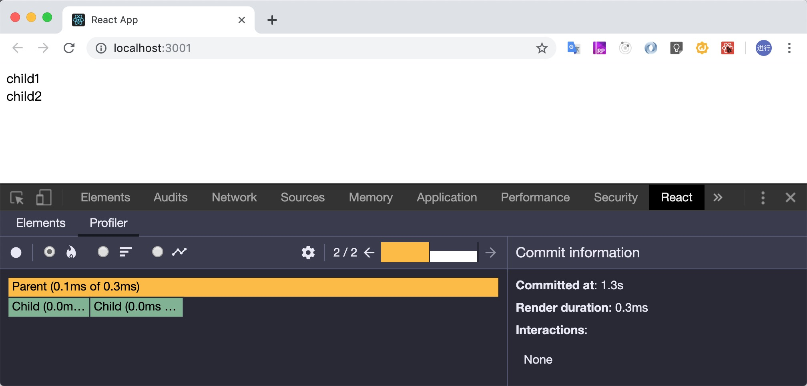
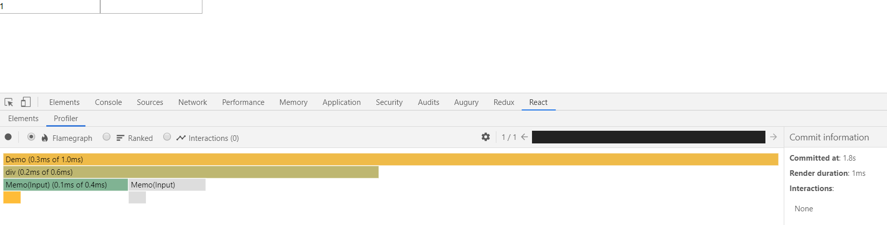
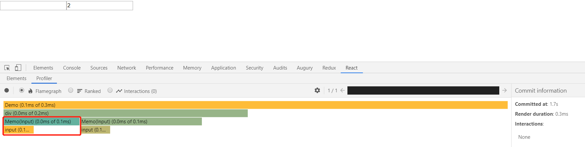
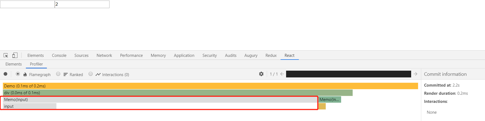
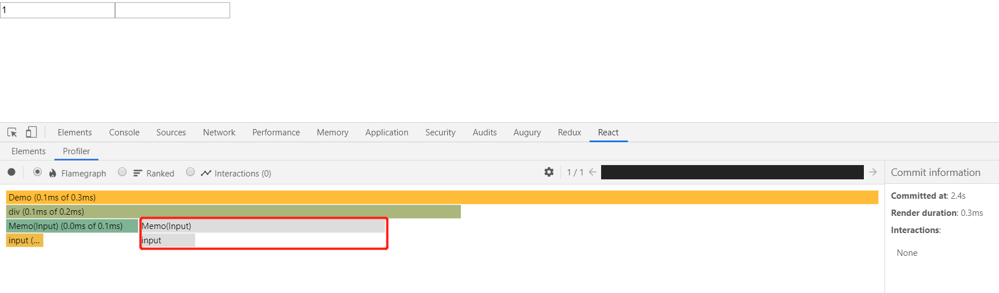
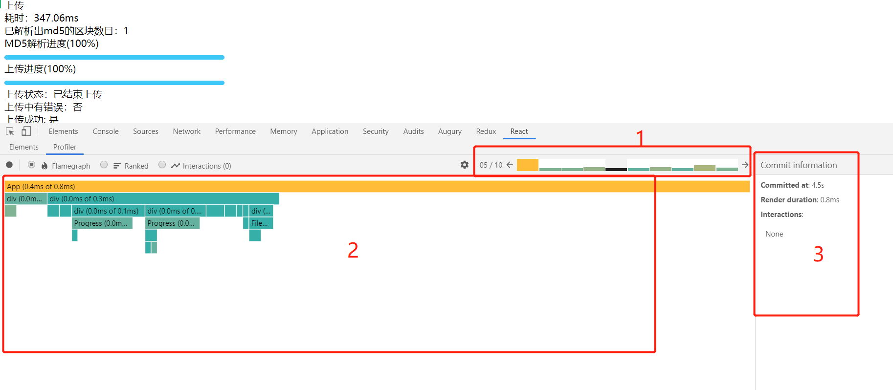
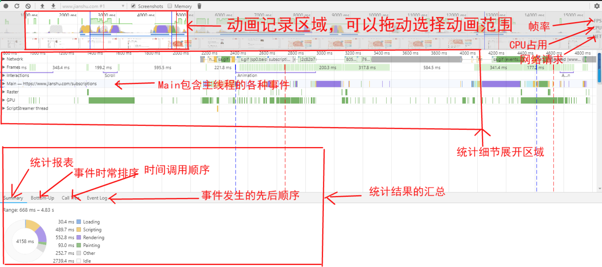
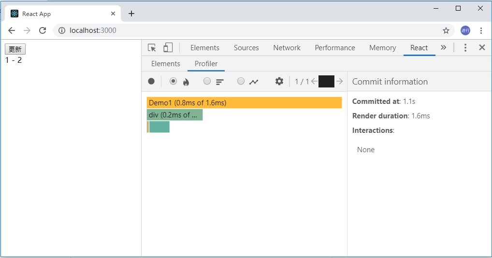
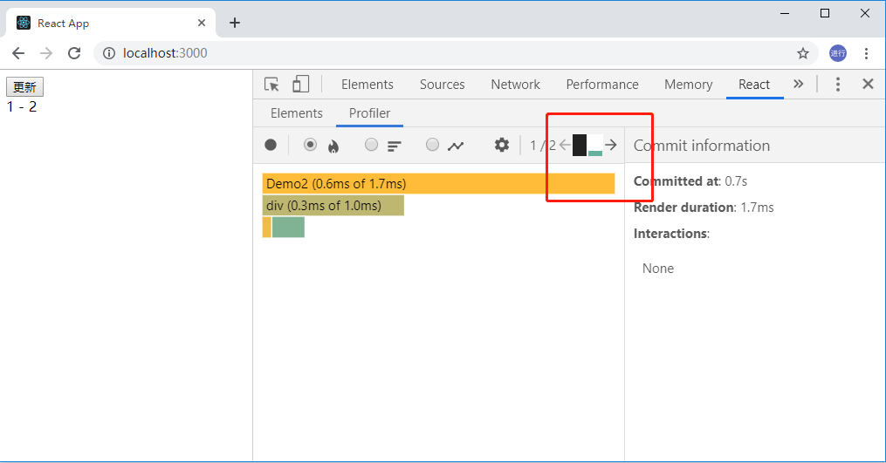

> 注意：此文档还在修改状态。

## 组件缓存

由于 React 并不知道在父组件中的更新是否会影响到其子代，所以 React 会在父组件更新时，将其所有子代也重绘，这会导致很大的性能消耗。为了减少这种不必要的性能损耗，我们可以使用**缓存**的方式处理子组件。这样当`props`浅层比较的结果相同时，父组件发生变化时，React 会去缓存中重用子组件先前的渲染结果，而不是重新渲染子组件。

> 使用[React.memo()](https://zh-hans.reactjs.org/docs/react-api.html#reactmemo)做组件缓存。

下面我们来对比看下使用缓存前后对性能的影响：

使用前：

```tsx
import React, { useState, useEffect } from 'react';
import ReactDOM from 'react-dom';

interface Props {
  title: string;
}

function Child(props: Props) {
  return <div>{props.title}</div>;
}

function Parent() {
  const [, setCount] = useState(0);

  useEffect(() => {
    // 每隔一秒钟重绘一次组件
    setInterval(() => {
      setCount((prev) => prev + 1);
    }, 1000);
  }, []);

  return (
    <div>
      <Child title="child1" />
      <Child title="child2" />
    </div>
  );
}

ReactDOM.render(<Parent />, document.getElementById('root'));
```

`Parent`组件每隔一秒钟发生一次状态变更，两个`Child`组件也会发生重绘，如下面的 React 渲染火焰图所示（绿色方格代表发生了重绘）：



为了避免不必要的渲染，我们可以对上述示例稍加调整：

```tsx
import React, { useState, useEffect } from 'react';
import ReactDOM from 'react-dom';

interface Props {
  title: string;
}

function Child(props: Props) {
  return <div>{props.title}</div>;
}

const MemoChild = React.memo(Child);

function Parent() {
  const [, setCount] = useState(0);

  useEffect(() => {
    // 每隔一秒钟重绘一次组件
    setInterval(() => {
      setCount((prev) => prev + 1);
    }, 1000);
  }, []);

  return (
    <div>
      <MemoChild title="child1" />
      <MemoChild title="child2" />
    </div>
  );
}

ReactDOM.render(<Parent />, document.getElementById('root'));
```

这里我们使用[React.memo](https://zh-hans.reactjs.org/docs/react-api.html#reactmemo)做了组件缓存，因此在`Parent`组件状态发生变化时，两个`Child`组件因为属性没有发生变化，React 会从缓存中取其上次的渲染结果，而不是重新传染。渲染效果如下（火焰图中的两个`Memo(Child)`小方格都是灰色的，代表未发生重绘）：



### `props`浅层比较

```js
const objA = {
    a: '1',
    b: '2',
}

const objB = {
    a: '1',
    b: '2'
};

Object.keys(objA).every(key=>objA[key] === objB[key]); // true
```


#### 函数属性

这里我们首先来看一个示例：

```tsx
import React, { useState, ChangeEvent } from 'react';
import ReactDOM from 'react-dom';

function Input(props: any) {
  return <input type="text" value={props.value} onChange={props.onChange} />;
}

const TextInput = React.memo(Input);

function Demo() {
  const [value1, setValue1] = useState('');
  const [value2, setValue2] = useState('');

  const onChangeValue1 = (event: ChangeEvent<HTMLInputElement>) => {
    setValue1(event.target.value);
  };

  const onChangeValue2 = (event: ChangeEvent<HTMLInputElement>) => {
    setValue2(event.target.value);
  };

  return (
    <div>
      <TextInput value={value1} onChange={onChangeValue1} />
      <TextInput value={value2} onChange={onChangeValue2} />
    </div>
  );
}

ReactDOM.render(<Demo />, document.getElementById('root'));
```

思考一个问题：此时如果改变第二个`TextInput`值，第一个`TextInput`会重新渲染吗？

一定会的，看下渲染结果：



可能你会有疑问：不是已经用了`React.memo`缓存了吗？为什么还会重新渲染呢？

其实这是因为`TextInput`的`onChange`属性，这是一个用来监听值变化的回调函数，输入框的值发生改变时，`Demo`组件会重绘，而此时`onChange`属性会指向一个新的方法，此时`TextInput`的属性浅层比较会返回`false`,组件就会重新渲染。

解决上述问题有两种方式：

方式一：使用[React.useCallback](https://zh-hans.reactjs.org/docs/hooks-reference.html#usecallback)缓存处理值变化的方法

```tsx
import React, { useState, ChangeEvent, useCallback } from 'react';
import ReactDOM from 'react-dom';

function Input(props: any) {
  return <input type="text" value={props.value} onChange={props.onChange} />;
}

const TextInput = React.memo(Input);

function Demo() {
  const [value1, setValue1] = useState('');
  const [value2, setValue2] = useState('');

  const onChangeValue1 = useCallback((event: ChangeEvent<HTMLInputElement>) => {
    setValue1(event.target.value);
  }, []);

  const onChangeValue2 = useCallback((event: ChangeEvent<HTMLInputElement>) => {
    setValue2(event.target.value);
  }, []);

  return (
    <div>
      <TextInput value={value1} onChange={onChangeValue1} />
      <TextInput value={value2} onChange={onChangeValue2} />
    </div>
  );
}

ReactDOM.render(<Demo />, document.getElementById('root'));
```

上述示例中,`useCallback`的依赖项数组为`[]`，所以，`onChangeValue1`与`onChangeValue2`这两个方法只会在组件初始化时创建一次，后续组件值发生改变时，会直接使用它的`memoized`版本。因此当其中一个`TextInput`的值发生改变时，另一个`TextInput`组件的属性满足浅层比较，React 会从缓存读取其上次渲染结果，而非重新渲染。



方式二：使用[React.useReducer](<https://zh-hans.reactjs.org/docs/hooks-reference.html#usereducer>)处理值变化

```tsx
import React, { ChangeEvent, useReducer } from 'react';
import ReactDOM from 'react-dom';
import produce from 'immer';

interface Action {
  type: string;
  payload: any;
}

interface State {
  [name: string]: any;
}

const reducer = produce((state: State, action: Action) => {
  switch (action.type) {
    case 'CHANGE_VALUE':
      state[action.payload.name] = action.payload.value;
      return state;
    default:
      return state;
  }
});

function Input(props: any) {
  const onChangeValue = (event: ChangeEvent<HTMLInputElement>) => {
    props.dispatch({
      type: 'CHANGE_VALUE',
      payload: { name: props.name, value: event.target.value },
    });
  };
  return <input type="text" value={props.value} onChange={onChangeValue} />;
}

const TextInput = React.memo(Input);

function Demo() {
  const [state, dispatch] = useReducer(reducer, {});

  return (
    <div>
      <TextInput value={state.value1} name="value1" dispatch={dispatch} />
      <TextInput value={state.value2} name="value2" dispatch={dispatch} />
    </div>
  );
}

ReactDOM.render(<Demo />, document.getElementById('root'));
```

上述示例中，我们向子组件传递`dispatch`而不是回调函数。这样当第一个`TextInput`值发生改变时，第二个`TextInput`组件的属性并没有发生改变，因此其不会重新渲染。



## React.memo()

`React.memo` 为[高阶组件](https://zh-hans.reactjs.org/docs/higher-order-components.html)。它与 [`React.PureComponent`](https://zh-hans.reactjs.org/docs/react-api.html#reactpurecomponent) 非常相似，但它适用于函数组件，但不适用于 class 组件。

如果你的函数组件在给定相同 props 的情况下渲染相同的结果，那么你可以通过将其包装在 `React.memo` 中调用，以此通过记忆组件渲染结果的方式来提高组件的性能表现。这意味着在这种情况下，React 将跳过渲染组件的操作并直接复用最近一次渲染的结果。

```jsx
function Child({ seconds }) {
  console.log('I am rendering');
  return <div>I am update every {seconds} seconds</div>;
}
export default React.memo(Child);
```

默认情况下`React.memo`只会对复杂对象做浅层对比，如果你想要控制对比过程，那么请将自定义的比较函数通过第二个参数传入来实现，第二个参数用于对比 props 控制是否刷新，与类组件的`shouldComponentUpdate`类似。

```tsx
function Child({ seconds }) {
  console.log('I am rendering');
  return <div>I am update every {seconds} seconds</div>;
}

function areEqual(prevProps, nextProps) {
  if (prevProps.seconds === nextProps.seconds) {
    return true;
  } else {
    return false;
  }
}
export default React.memo(Child, areEqual);
```

> **_注意：_**
>
> - 此方法仅作为性能优化的方式存在，不能依赖它去限制组件渲染。
> - 与 class 组件中 [`shouldComponentUpdate()`](https://zh-hans.reactjs.org/docs/react-component.html#shouldcomponentupdate) 方法不同的是，如果 props 相等，`areEqual` 会返回 `true`；如果 props 不相等，则返回 `false`。这与 `shouldComponentUpdate` 方法的返回值相反。

## React.useMemo

主要用途：

- 把“创建”函数和依赖项数组作为参数传入 `useMemo`，它仅会在某个依赖项改变时才重新计算 `memoized` 值。这种优化有助于避免在每次渲染时都进行高开销的计算。

  ```js
  function demo() {
    const pagination = React.useMemo(
      () => ({
        pageSize: pageSize,
        currentPage: pageNo + 1,
        total: totalElements,
      }),
      [pageNo, pageSize, totalElements],
    );
  }
  ```

- 如果子组件是一个 memo 组件，接收一个对象属性，使用 useMemo 处理改对象属性，则可以减少子组件不必要的渲染

  ```js
  // 子组件
  const Child = React.memo((props) => {});

  function Parent(props) {
    return <Child item={{ id: '2' }} />;
  }
  ```

  上述情况 memo 将失效，为了更好的减少组件不必要的渲染，我们可以按照下面方式处理

  ```js
  // 子组件
  const Child = React.memo(props=>{

  })

  function Parent(props){
      const item = React.useMemo(
      () => ({
        pageSize: pageSize,
        currentPage:pageNo + 1,
        total: totalElements,
      }),
      [
        pageNo,
        pageSize,
        totalElements,
      ],
    );
  }
      return <Child item={item}/>
  }

  ```

  此时，只有在`pageNo`,`pageSize`,`totalElements`发生变化时，子组件才会重新渲染。父组件其它属性发生变化时，子组件不会重新渲染。

**切记：**传入 `useMemo` 的函数会在渲染期间执行。请不要在这个函数内部执行与渲染无关的操作。

## React.useCallback

```js
const memoizedCallback = useCallback(() => {
  doSomething(a, b);
}, [a, b]);
```

此方法返回一个`memoized`回调函数。

把内联回调函数及依赖项数组作为参数传入 `useCallback`，它将返回该回调函数的 `memoized`版本，该回调函数仅在某个依赖项改变时才会更新。当你把回调函数传递给经过优化的并使用引用相等性去避免非必要渲染（例如 `shouldComponentUpdate`）的子组件时，它将非常有用。

`useCallback(fn, deps)` 相当于 `useMemo(() => fn, deps)`。

## React.useReducer

`useReducer`之所以能对深层子组件有性能优化的作用，是因为我们向子组件传递`dispatch`而不是多个回调函数。

如果 reducer hook 的返回值与当前的 state 相同，React 将跳过子组件的渲染及副作用的执行。（React 使用 [`Object.is` 比较算法](https://developer.mozilla.org/en-US/docs/Web/JavaScript/Reference/Global_Objects/Object/is#Description) 来比较 state。）

## 火焰图

这是 react-devtools 里的一个性能分析工具，结果如图：



图中有三块区域：

1. 组件渲染次数
2. 每次渲染时相关组件的渲染情况
3. 渲染信息

## performance 分析

这是 Chrome 浏览器自带的性能分析工具。

操作：

打开控制台，切换到`Performance`页签，确保 screenshots checkbox 是选中的，然后点击 controls，开始记录（windows 快捷键 shift + E），这时候 Devtools 就开始录制各种性能指标，你可以点击页面等进行各种操作，所有的操作都会被浏览器录制下来。录制期间， 可以点击 stop 进行快速操作结束录制，然后等待显示性能报告，stop 按钮位置如下图：


分析结果如下：



上图一共有三个区域：

1. overview 总览图，高度概括随时间线的变动，包括 FPS，CPU，NET
2. 火焰图，从不同的角度分析框选区域 。例如：Network，Frames, Interactions, Main 等
3. 总结区域：精确到毫秒级的分析，以及按调用层级，事件分类的整理

### overview

Overview 窗格包含以下三个图表：

1.  FPS。每秒帧数。绿色竖线越高，FPS 越高。 FPS 图表上的红色块表示长时间帧，很可能会出现卡顿
2.  CPU。 CPU 资源。此面积图指示消耗 CPU 资源的事件类型
3.  NET。每条彩色横杠表示一种资源。横杠越长，检索资源所需的时间越长。 每个横杠的浅色部分表示等待时间（从请求资源到第一个字节下载完成的时间）

可以放大显示一部分记录，以便简化分析。使用 Overview 窗格可以放大显示一部分记录。 放大后，火焰图会自动缩放以匹配同一部分

### 火焰图

在火焰图上看到一到三条垂直的虚线。蓝线代表 DOMContentLoaded 事件。 绿线代表首次绘制的时间。 红线代表 load 事件

在火焰图中选择事件时，Details 窗格会显示与事件相关的其他信息。

### 总结区域

蓝色(Loading)：网络通信和 HTML 解析
黄色(Scripting)：JavaScript 执行
紫色(Rendering)：样式计算和布局，即重排
绿色(Painting)：重绘
灰色(other)：其它事件花费的时间
白色(Idle)：空闲时间

## class 组件的 shouldComponentUpdate

使用`shouldComponentUpdate()`可以让 React 知道当前状态或属性的改变是否不影响组件的输出，默认返回 ture，返回 false 时不会重新渲染。

```JS
class CounterButton extends React.Component {
  constructor(props) {
    super(props);
    this.state = {count: 1};
  }

  shouldComponentUpdate(nextProps, nextState) {
    if (this.props.color !== nextProps.color) {
      return true;
    }
    if (this.state.count !== nextState.count) {
      return true;
    }
    return false;
  }

  render() {
    return (
      <button
        color={this.props.color}
        onClick={() => this.setState(state => ({count: state.count + 1}))}>
        Count: {this.state.count}
      </button>
    );
  }
}
```

上述示例中只有当`props.color`或者`state.count`值发生变化时，组件才会重新渲染。

如果更复杂一些的组件，我们可以使用类似“浅比较”的模式来检查 `props` 和 `state` 中所有的字段，以此来决定是否组件需要更新。React 已经提供了一位好帮手来帮你实现这种常见的模式 - 你只要继承 `React.PureComponent` 就行了。所以这段代码可以改成以下这种更简洁的形式：

```jsx
class CounterButton extends React.PureComponent {
  constructor(props) {
    super(props);
    this.state = { count: 1 };
  }

  render() {
    return (
      <button
        color={this.props.color}
        onClick={() => this.setState((state) => ({ count: state.count + 1 }))}
      >
        Count: {this.state.count}
      </button>
    );
  }
}
```

## 减小视图大小

> 减小视图大小也是一个非常有用的优化手段。

比如我们有一个数据非常多的长列表，如果我们一次性渲染，肯定会性能非常差，但是如果我们只渲染看得见的部分，性能就得到了极大的提升。

下面举一个通过[windowing](https://react-window.now.sh)的例子说明一下：

```jsx
import { FixedSizeList as List } from 'react-window';

const Row = ({ index, style }) => <div style={style}>Row {index}</div>;

const Example = () => (
  <List height={150} itemCount={1000} itemSize={35} width={300}>
    {Row}
  </List>
);
```

在[CodeSandBox](https://codesandbox.io/s/github/bvaughn/react-window/tree/master/website/sandboxes/fixed-size-list-vertical)上看一下运行效果。

这个长列表有 1000 个数据项，但是一次性只渲染 10 条数据项。这个列表的性能就会非常好。

对于不可见的 UI 部分，我们都可以采用延迟渲染的技巧来减少视图大小，提升性能。

## 状态更新合并

React 对状态更新做了一个优化：同时多次设置状态，不会引起多次重绘，而只会合并为一次重绘。当然这个优化是有前提的。我们来看两个例子。

例子 1：

```tsx
import ReactDOM from 'react-dom';
import React, { useState } from 'react';

function Demo1() {
  const [A, setA] = useState();
  const [B, setB] = useState();

  const handleClick = () => {
    setA(1);
    setB(2);
  };

  return (
    <div>
      <button onClick={handleClick}>更新</button>
      <div>
        {A} - {B}
      </div>
    </div>
  );
}

ReactDOM.render(<Demo1 />, document.getElementById('root'));
```

点击例子 1 中的按钮，它会分别更新`A`和`B`两个状态，但是却只重绘了一次`Demo1`组件：



再看看例子 2：

```tsx
import ReactDOM from 'react-dom';
import React, { useState } from 'react';

function Demo2() {
  const [A, setA] = useState();
  const [B, setB] = useState();

  const handleClick = () => {
    setTimeout(() => {
      setA(1);
      setB(2);
    });
  };

  return (
    <div>
      <button onClick={handleClick}>更新</button>
      <div>
        {A} - {B}
      </div>
    </div>
  );
}

ReactDOM.render(<Demo2 />, document.getElementById('root'));
```

点击例子 2 中的按钮，你会发现`Demo2`组件重绘了两次：



分析例子 2 与例子 1 的代码不同：

```diff
import ReactDOM from 'react-dom';
import React, { useState } from 'react';

function Demo2() {
  const [A, setA] = useState();
  const [B, setB] = useState();

  const handleClick = () => {
+   setTimeout(() => {
      setA(1);
      setB(2);
+   });
  };

  return (
    <div>
      <button onClick={handleClick}>更新</button>
      <div>
        {A} - {B}
      </div>
    </div>
  );
}

ReactDOM.render(<Demo2 />, document.getElementById('root'));
```

最重要的区别是：

```ts
setTimeout(() => {
  setA(1);
  setB(2);
});
```

在`setTimeout()`中执行状态更新，每一次状态更新都会引起重绘，而不会合并为一次重绘。不仅仅是`setTimeout()`，还包括`setInterval()`、`Promise`、`web socket`、`ajax`、`Observable`等都是这样的。这是因为这些状态更新不是在 React Scheduler 中而是在其他环境中执行的。这里不深入展开对 React Scheduler 的分析，大家感兴趣的可以了解一下相关知识。

目前有两种方式解决：

方式一：使用`useReducer`：

```tsx
import ReactDOM from 'react-dom';
import React, { useReducer } from 'react';

function reducer(
  state: { A?: number; B?: number },
  action: { type: 'CHANGE' },
) {
  switch (action.type) {
    case 'CHANGE':
      return {
        A: 1,
        B: 2,
      };
    default:
      return state;
  }
}

function Demo3() {
  const [state, dispatch] = useReducer(reducer, {});

  const handleClick = () => {
    setTimeout(() => {
      dispatch({ type: 'CHANGE' });
    });
  };

  return (
    <div>
      <button onClick={handleClick}>更新</button>
      <div>
        {state.A} - {state.B}
      </div>
    </div>
  );
}

ReactDOM.render(<Demo3 />, document.getElementById('root'));
```

方式二：使用`ReactDOM.unstable_batchedUpdates()`：

```tsx
import ReactDOM from 'react-dom';
import React, { useState } from 'react';

function Demo2() {
  const [A, setA] = useState();
  const [B, setB] = useState();

  const handleClick = () => {
    setTimeout(() => {
      ReactDOM.unstable_batchedUpdates(() => {
        setA(1);
        setB(2);
      });
    });
  };

  return (
    <div>
      <button onClick={handleClick}>更新</button>
      <div>
        {A} - {B}
      </div>
    </div>
  );
}

ReactDOM.render(<Demo2 />, document.getElementById('root'));
```

`ReactDOM.unstable_batchedUpdates(fn)`会在 React Scheduler 上下文中执行`fn`函数，所以`setA(1)`和`setB(2)`就会得到 React Scheduler 的优化，只会引发一次重绘。

但是`ReactDOM.unstable_batchedUpdates()` API 还处于不稳定状态，而且是从`ReactDOM`中引出来的，就会有`React Native`的兼容性问题。建议使用`import { batch } from 'react-redux';`中的`batch`代替`ReactDOM.unstable_batchedUpdates`。

## 参考资料

- [将 React 作为 UI 运行时](https://overreacted.io/zh-hans/react-as-a-ui-runtime)
- [Why React is Not Reactive?](https://www.beautiful.ai/deck/-LIw2oTJmrrwRqvsoYgD/Why-React-is-Not-Reactive)
- [React Fiber Architecture](https://github.com/acdlite/react-fiber-architecture)
- [[Question] Keep to single setState call?](https://github.com/facebook/react/issues/10231)
- [SMOOSHCAST: React Fiber Deep Dive with Dan Abramov](https://www.youtube.com/watch?v=aS41Y_eyNrU&feature=youtu.be)
