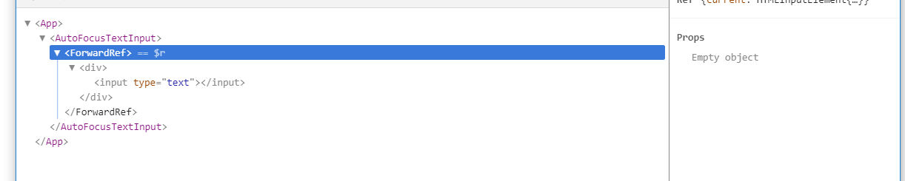
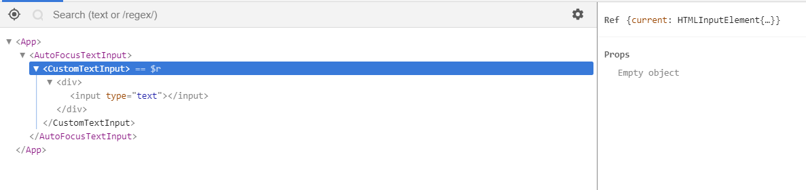

在 React 中，Ref 主要用于下面两个用途：

- 引用 DOM 节点
- 函数组件中的“实例变量”

本篇文章将会阐述这两个常见用法。

## DOM Refs

此章节对应的是 Ref 的第一个用途，即“引用 DOM 节点”，我们称之为`DOM Refs`。

> Refs 提供了一种方式，允许我们访问 DOM 节点或在 render 方法中创建的 React 元素。

在典型的 React 数据流中，[props](组件属性和状态.md)是父组件与子组件交互的唯一方式。要修改一个子组件，你需要使用新的 props 来重新渲染它。但是，在某些情况下，你需要在典型数据流之外强制修改子组件。被修改的子组件可能是一个 React 组件的实例，也可能是一个 DOM 元素。对于这两种情况，React 都提供了解决办法。

### 何时使用 Refs

下面是几个适合使用 refs 的情况：

- 管理焦点、文本选择或媒体播放。
- 触发强制动画。
- 集成第三方 DOM 库。

**避免使用 refs 来做任何可以通过声明式实现来完成的事情。**举个例子，避免在`Dialog`组件里暴露`open()`和`close()`方法，最好传递`isOpen`属性。

### 创建 refs

在函数组件中，使用[useRef](https://zh-hans.reactjs.org/docs/hooks-reference.html#useref)创建 refs，并可以通过`ref`属性附加到 React 元素。

```tsx
import React, { useRef } from 'react';

function MyComponent() {
  const myRef = useRef();

  return <div ref={myRef} />;
}
```

在类组件中，使用[React.createRef()](https://zh-hans.reactjs.org/docs/react-api.html#reactcreateref)创建 refs，并可以通过`ref`属性附加到 React 元素。我们通常将 refs 分配给实例属性。

```tsx
class MyComponent extends React.Component {
  constructor(props) {
    super(props);
    this.myRef = React.createRef();
  }
  render() {
    return <div ref={this.myRef} />;
  }
}
```

### 访问 refs

`ref`是一个有`current`属性的对象，`current`属性就是被引用的节点。

函数组件中：

```tsx
const node = myRef.current;
```

类组件中：

```tsx
const node = this.myRef.current;
```

ref 的值根据节点的类型而有所不同：

- 当`ref`属性用于 HTML 元素时，通过`useRef`或者`createRef`创建的`ref`接收底层 DOM 元素作为其`current`属性。
- 当`ref`属性用于自定义 class 组件时，`ref`对象接收组件的挂载实例作为其`current`属性。
- 你不能在函数组件上使用`ref`属性，因为它们没有实例。

### 为 DOM 元素添加 ref

函数组件：

```tsx
import React, { useRef } from 'react';

function CumstomTextInput() {
  const textInputRef = useRef<HTMLInputElement>();

  const focusTextInput = () => {
    if (textInputRef.current) {
      textInputRef.current.focus();
    }
  };

  return (
    <div>
      <input type="text" ref={textInputRef} />
      <button onClick={focusTextInput}>Focus the text input</button>
    </div>
  );
}
```

类组件：

```tsx
class CustomTextInput extends React.Component {
  constructor(props) {
    super(props);
    // 创建一个 ref 来存储 textInput 的 DOM 元素
    this.textInput = React.createRef();
    this.focusTextInput = this.focusTextInput.bind(this);
  }

  focusTextInput() {
    // 直接使用原生 API 使 text 输入框获得焦点
    // 注意：我们通过 "current" 来访问 DOM 节点
    this.textInput.current.focus();
  }

  render() {
    // 告诉 React 我们想把 <input> ref 关联到
    // 构造器里创建的 `textInput` 上
    return (
      <div>
        <input type="text" ref={this.textInput} />

        <input
          type="button"
          value="Focus the text input"
          onClick={this.focusTextInput}
        />
      </div>
    );
  }
}
```

React 会在组件挂载时给`current`属性传入 DOM 元素，并在组件卸载时传入`null`值。`ref`会在`useEffect`、`componentDidMount`、`componentDidUpdate`触发之前更新。

### 为 class 组件添加 ref

如果我们想包装上面的`CustomTextInput`（类组件），来模拟它挂载之后立即被点击的操作，我们可以使用 ref 来获取这个自定义的 input 组件并手动调用它的`focusTextInput`方法：

```tsx
class AutoFocusTextInput extends React.Component {
  constructor(props) {
    super(props);
    this.textInput = React.createRef<CustomTextInput>();
  }

  componentDidMount() {
    this.textInput.current.focusTextInput();
  }

  render() {
    return <CustomTextInput ref={this.textInput} />;
  }
}
```

请注意：`CustomTextInput`是类组件时，上面的代码才有效！

### 将 DOM Refs 暴露给父组件

在极少数情况下，你可能希望在父组件中引用子节点的 DOM 节点。通常不建议这样做，因为它会打破组件的封装，但它偶尔可用于触发焦点或测量子 DOM 节点的大小或位置。

虽然你可以向[子组件添加 ref](为-class-组件添加-ref)，但这不是一个理想的解决方案，因为你只能获取组件实例而不是 DOM 节点。并且，它还在函数组件上无效。

有以下几种方式：

- Ref 转发：Ref 转发使组件可以像暴露自己的 ref 一样暴露子组件的 ref。
- 使用其他的属性名传递`ref`，如 styled-components 旧版本通过`innerRef`属性接收`ref`。
- 使用[findDOMNode()](https://zh-hans.reactjs.org/docs/react-dom.html#finddomnode)获取子组件的 DOM 元素。 —— 警告：不要再使用这个 API，即将被废弃。

这里重点说一下 Ref 转发。

上文我们在`AutoFocusTextInput`时，只处理了 class 组件的版本，如果是函数组件，可以通过 ref 转发来实现。

`CustomTextInput`组件：

```tsx
import React, { useRef } from 'react';

const CumstomTextInput = React.forwardRef(function(props, ref) {
  return (
    <div>
      <input type="text" ref={ref} />
    </div>
  );
});

CustomTextInput.displayName = 'CustomTextInput';

export default CustomTextInput;
```

`AutoFocusTextInput`组件：

```tsx
import React, { useRef } from 'react';
import './CustomTextInput';

function AutoFocusTextInput() {
  const textInputRef = useRef();

  useEffect(() => {
    if (textInputRef.current) {
      textInputRef.current.focus();
    }
  }, []);

  return <CustomTextInput ref={textInputRef} />;
}
```

重点：

- [React.forward()](https://zh-hans.reactjs.org/docs/react-api.html#reactforwardref) 会创建一个 React 组件，这个组件能够将其接收的 ref 属性转发到其组件树下的另一个组件中。
- `CustomTextInput.displayName = 'CustomTextInput';`是为了在调试工具中显示正确的组件名，方便调试。

可以看一下去掉`CustomTextInput.displayName = 'CustomTextInput';`前后的 React Devtools 展现的元素树结构：

去掉后：



加上后：



## 函数组件中的“实例变量”

在函数组件中，我们可以使用`useRef()`创建一个`ref`对象。不管这个函数组件重绘了多少次，`useRef()`返回的总是第一次渲染此函数组件时创建的`ref`对象。而且`ref`对象的`current`属性可以存放任何 js 数据，所以，我们可以借助`useRef()`创建的`ref`对象实现类似 class 的“实例变量”。

如下面的例子：

```tsx
function Timer() {
  const intervalRef = useRef();

  useEffect(() => {
    const id = setInterval(() => {
      // ...
    });
    intervalRef.current = id;
    return () => {
      clearInterval(intervalRef.current);
    };
  });

  // ...
}
```

## 参考文章

- [Refs and the DOM](https://zh-hans.reactjs.org/docs/refs-and-the-dom.html)
- [Refs 转发](https://zh-hans.reactjs.org/docs/forwarding-refs.html)
- [useRef API](https://zh-hans.reactjs.org/docs/hooks-reference.html#useref)
- [React Hooks FAQ - 有类似实例变量的东西吗？](https://zh-hans.reactjs.org/docs/hooks-faq.html#is-there-something-like-instance-variables)
