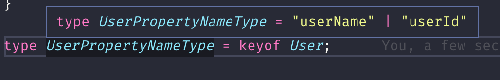

TypeScript 最有用的特性是静态类型。TypeScript 每个新版本发布都会带来一些新的类型特性。本章节介绍一些不常见但是在开发组件、库等公共模块时非常有用的 TypeScript 高级类型。

## 类型别名

我们可以用`type`关键字来给类型取别名。

```typescript
type Name = string;
type NameResolver = () => string;
type NameOrResolver = Name | NameResolver;

function getName(n: NameOrResolver): Name {
  if (typeof n === 'string') {
    return n;
  } else {
    return n();
  }
}
```

注意：不建议使用`type`定义接口类型，应使用`interface`来定义接口类型。`type`通用用来需要做类型运算的场景中。

## 索引类型

首先介绍`keyof`（**索引类型查询操作符**)。

User 接口：

```typescript
interface User {
  userName: string;
  userId: string;
}
```

User 接口的属性名类型：

```
type UserPropertyNameType = 'userName' | 'userId';
```

这样下面的代码就是有效的：

```typescript
function logUserPropertyValue(user: User, propertyName: UserPropertyNameType) {
  console.log(user[propertyName]);
}
```

`keyof`关键字可以简化接口的属性名类型：

```typescrpt
type UserPropertyNameType = keyof User;
```

如下所示：



`logUserPropertyValue`方法改造后如下：

```typescript
function logUserPropertyValue(user: User, propertyName: keyof User) {
  console.log(user[propertyName]);
}
```

现在我们要获取`user`对象的属性值，方法如下：

```typescript
function getUserPropertyValue(user: User, propertyName: keyof User): string {
  return user[propertyName];
}
```

上面的方法没有问题，函数返回值是`string`也没有问题，因为目前来看，User 接口的所有属性的值类型都是`string`。如果我们在`User`中加一个`age`呢？

```typescript
interface User {
  userName: string;
  userId: string;
  age: number;
}
```

`getUserPropertyValue`的返回值类型应该是什么？是`string| number`呢？是，也不是。因为 User 所有属性的值类型就是`string`和`number`的两者结合，所以它的返回值是`string | number`是没有问题的。但是，我们可以做得更好：`getUserPropertyValue()`函数的返回值类型是根据`propertyName`这个参数的类型决定的，如果`propertyName`的参数类型是`userName`或者是`userId`，那么它的返回值类型是`string`，如果是`age`，则返回值类型是`number`。这种变化的类型以及固定的类型关系，我们可以使用泛型来解决，如下：

```typescript
function getUserPropertyValue<P extends keyof User>(
  user: User,
  propertyName: P,
): [这个地方需要通过P推导出返回值类型] {
  return user[propertyName];
}
```

上面的代码有一块是没有实现的：`[这个地方需要通过P推导出返回值类型]`。这一块是需要在`User`接口中找到`P`这个代表 User 接口属性名的类型对应的值类型。在 TypeScript 中，我们可以写成`User[P]`。所以我们的方法是：

```typescript
function getUserPropertyValue<P extends keyof User>(
  user: User,
  propertyName: P,
): User[P] {
  return user[propertyName];
}
```

在 TypeScript 的类型中，`User[P]`这样的表示式表示从`User`接口中取`P`这个属性对应的值类型，我们称之为**索引访问操作符**。如下所示：

```typescript
interface User {
  userName: string;
  userId: string;
  age: number;
}

type userNameValueType = User['userName']; // string;
type ageValueType = User['age']; // age
```

现在，发现获取对象属性这个方法还是挺有用的，不仅仅用于`User`接口的对象，其他任何接口的对象实现逻辑都是一样的，但是对象的类型不一样，所以我们可以对对象类型使用泛型，来解决类型声明问题：

```typescript
function getPropertyValue<T, P extends keyof T>(obj: T, propertyName: P): T[P] {
  return obj[propertyName];
}
```

## 映射类型

首先说两个关键字：`Readonly`和`Partial`，它们的作用通过下面两段代码来理解一下：

```typescript
interface User {
  userName: string;
  userId: string;
  age: number;
}

type ReadonlyUser = Readonly<User>;
/** ReadonlyUser相当于：
{
  readonly userName: string;
  readonly userId: string;
  readonly age: number;
}
*/
```

```typescript
interface User {
  userName: string;
  userId: string;
  age: number;
}

type PartialUser = Partial<User>;
/** PartialUser相当于：
{
  userName?: string;
  userId?: string;
  age?: number;
}
*/
```

TypeScript 提供了从旧类型中创建新类型的一种方式 — **映射类型**。这有一些类似如 js 中的数组`map`方法——从旧数组中创建新数组。在映射类型里，新类型以相同的形式去转换旧类型里每个属性。比如，`Readonly<User>`会将`User`接口中每个属性设置成`readonly`来生成一个与 User 接口有一样的属性，但是所有属性都是`readonly`的新类型。

下面我们拿一个简单的示例，来剖析一下**映射类型**：

```typescript
type Keys = 'option1' | 'option2';
type Flags = { [K in Keys]: boolean };
```

- `Keys`表示的是属性名，这里有两种属性名，即`option1`和`option2`。
- `[K in Keys]`，表示遍历`Keys`中每个属性名，相当于`for .. in`语法。
- `K`相当于遍历过程中的属性名。
- `[K in Keys]: boolean`，表示`Keys`中的每个属性名都是`boolean`类型的。
- `{[K in Keys]: boolean}`得到有两个属性`option1`和`option2`，属性值类型都是`boolean`的类型。

`Flags`相当于：

```typescript
interface Flags {
  option1: boolean;
  option2: boolean;
}
```

现在我们拿`User`接口来练手，需要创建一个新的类型，包含所有的`User`属性，但是每个属性都是可选的：

```typescript
interface User {
  userName: string;
  userId: string;
  age: number;
}

type Keys = keyof User; // 'userName' | 'userId' | 'age';
type Flags = { [K in Keys]?: User[K] };
```

这样得出的`Flags`类型如下所示：

```typescript
interface Flags {
  userName?: string;
  userId?: string;
  age?: number;
}
```

我们给`Flags`换一个更合适的名称，并且省略掉 Keys：

```typescript
type PartialUser = { [K in keyof User]?: User[K] };
```

再拿一个`Animal`接口来做类似的练习：

```typescript
interface Animal {
  name: string;
  birthday: Date;
}

type PartialAnimal = { [K in keyof Animal]?: Animal[K] };
```

我们会发现相似之处：

```typescript
type PartialUser = { [K in keyof User]?: User[K] };
type PartialAnimal = { [K in keyof Animal]?: Animal[K] };
```

我们可以通过泛型来提供一个通用的版本：

```typescript
type Partial<T> = { [K in keyof T]?: T[K] };
```

这个`Partial`就是本章节开头介绍的。`Partial`是 TypeScript 内置的类型，可以直接用。

`Readonly`类型的实现：

```typescript
type Readonly<T> = { readonly [K in keyof T]: T[K] };
```

实现一个即可选又只读的类型：

```typescript
type PartialReadonly<T> = { readonly [K in keyof]?: T[K] };
```

还需要特别注意一下：

```typescript
interface User {
  readonly UserId: string;
  userName: string;
  age: number;
}

type PartialUser = Partial<User>;
/* PartialUser相当于：
{
  readonly userId?: string;
  userName?: string;
  age: number;
}
*/
```

在映射类型中，`T[K]`它不仅仅会带过来属性值类型，还会带过来这个属性相关的修饰符，如`User['userId']`会带过来`readonly`修饰符。这种现象称之为**同态**。

## 预定义类型

TypeScript 提供很多类似如`Readonly`、`Partial`这样的预定义类型，选择几个重点来说一说：

### `Readonly`

在映射类型中介绍过，会生成接口对应的只读属性版本。

### `Partial`

生成接口对应的可选属性版本。

### `Pick`

从接口中选择某些属性组成一个新的类型。

示例：

```typescript
interface User {
  userId: string;
  userName: string;
  age: number;
}

type AnotherUserType = Pick<User, 'userId' | 'age'>;
/*
AnotherUserType相当于：

{
  userId: string;
  age: number;
}
*/
```

Pick 的实现：

```typescript
type Pick<T, K extends keyof T> = { [P in K]: T[P] };
```

### `Record`

```typescript
type Record<K extends string, T> = { [P in K]: T };
```

### `Exclude<T, U>`

从`T`中剔除可以赋值给`U`的类型。

```typescript
type T00 = Exclude<'a' | 'b' | 'c' | 'd', 'a' | 'c' | 'f'>; // "b" | "d"
type T01 = Exclude<string | number | (() => void), Function>; // string | number
```

实现：

```typescript
type Exclude<T extends string, U extends string> = ({ [P in T]: P } &
  { [P in U]: never } & { [x: string]: never })[T];
```

### `Extract<T, U>`

提取`T`中可以赋值给`U`的类型。

```typescript
type T00 = Extract<'a' | 'b' | 'c' | 'd', 'a' | 'c' | 'f'>; // "a" | "c"
type T03 = Extract<string | number | (() => void), Function>; // () => void
```

### `ReturnType<T>`

获取函数返回值类型。

```typescript
function test() {
  return 1;
}

type T00 = ReturnType<() => string>; // string
type T01 = ReturnType<(s: string) => void>; // void
type T02 = ReturnType<typeof test>; // number
```

### `NonNullable<T>`

从`T`中剔除`null`和`undefined`。

```typescript
type T00 = NonNullable<string | number | undefined>; // string | number
type T01 = NonNullable<(() => string) | string[] | null | undefined>; // (() => string) | string[]
```

### `Omit<T, K>`

从类型`T`剔除赋值给`K`的类型所代表的属性。

示例：

```typescript
interface User {
  userId: string;
  userName: string;
  age: numer;
}

type T0 = Omit<User, 'userName'>; // { userId: string; age: number; }
type T1 = Omit<User, 'userName' | 'age'>; // { userId: string }
type T2 = Omit<User, 'age'>; // { userId: string; userName: string; }
```
